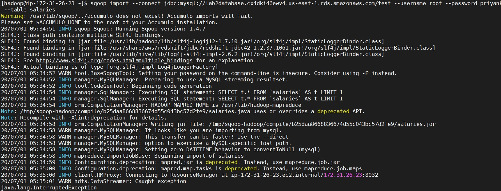

# Lab2: Importing RDBMS Data into HDFS

**Objective: Import data from a database into HDFS**

*Following are the steps for importing RDBMS data into HDFS:*

1. Open aws console and create an amazon RDS.

2. Connect this database to MySql workbench and make sure your database connect to workbench.

3. Create salaries table in connected database as follow:

	create table salaries(
        gender varchar(1),
        age int,
        salary double,
        zipcode int);

4. Load salaries.txt file data into this salaries table by using following command:
	
	load data local infile 'file path/salaries.txt' into table salaries fields terminated by ','

	If you get an infile error while inserting the data then perform following steps:

	  *  Close current SQL connection
	  *  Right click on your Connection and select 'Edit Connection'
	  *  Click on Advanced
 	  *  Add following line to 'Others'

    		 OPT_LOCAL_INFILE=1

	  *  Now Reconnect to your database 

5. Create EMR cluster and connect it with SSH.

6. Run sqoop import command to import data from sql database to hdfs.
	

7. Now check whether salaries directory is created on hdfs as follow:
	

8. Then use cat command to see the data in the file.

9. Now we will import only salary and age data from the database and put it into new directory named salaries2.
 	

10. Now check whether salaries2 directory is created on hdfs with 2 files present as shown below:
	

11. Then use cat command to see the data in the file.

12. Now we will use --split-by command to split our data according to a certain column value and put it into new directory named salaries3.

13. Now check whether salaries3 directory is created on hdfs with 3 files present as shown below:
      

14. Then use cat command to see the data in the file.
	

	

  

	

	
