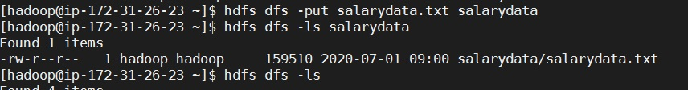
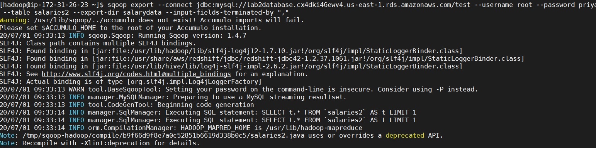
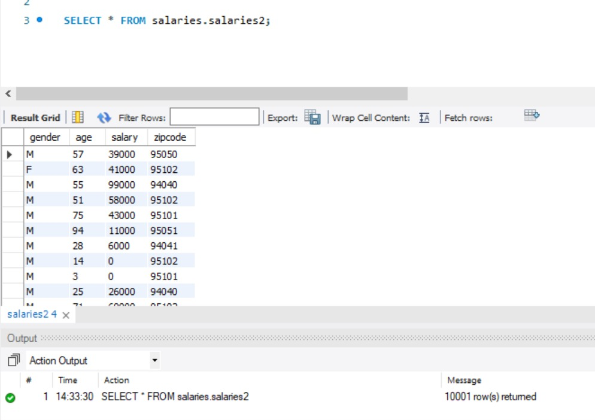

# Lab2: Exporting data from HDFS to RDBMS.

**Objective: Export data from HDFS to RDBMS**

*Following are the steps for importing RDBMS data into HDFS:*

1. Create a new hdfs directory using mkdir command with name salarydata.

2. Put salarydata.txt into the salarydata directory in HDFS and Check whether the file is created on hdfs.

3. Create a new Table in the Database as salaries2 using following sql command

create table salaries2 ( gender varchar(1), age int, salary double, zipcode int);

4. Now export data from hdfs to database

 

5. Check whether all records are been exported successfully.

