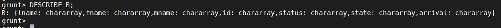

# Lab: Getting Started with Pig

**Objective: Use Pig to navigate through HDFS and explore a dataset

*Following are the steps for importing RDBMS data into HDFS:*

*Open aws console and create an amazon EMR cluster.*

*Connect amazon EMR cluster to Mobaxterm SSH.*

1. View the Raw Data

    * unzip whitehouse_visits file.

    * View the contents of this file:

2. Load the Data into HDFS
    * a. Start the Grunt shell:

    * b. From the Grunt shell, make a new directory in HDFS named whitehouse:

    * c. Use the copyFromLocal command in the Grunt shell to copy the whitehouse_visits.txt file to the whitehouse folder in HDFS,   renaming the file visits.txt.

    * d. Use the ls command to verify that the file was uploaded successfully:

3. Define a Relation

    * a. You will use the TextLoader to load the visits.txt file

    * b. Use DESCRIBE to notice that A does not have a schema:

    * c. We want to get a sense of what this data looks like. Use the LIMIT operator to define a new relation named A_limit that is limited to 10 records of A.

    * d. Use the DUMP operator to view the A_limit relation. Each row in the output will look similar to the following and should be 10
    arbitrary rows from visits.txt:

4.  Define a Schema

    * a. Load the White House data again, but this time use the PigStorage loader and also define a partial schema:

    

    * b. Use the DESCRIBE command to view the schema

    

5. The STORE Command

    * a. Enter the following STORE command, which stores the B relation into a folder named whouse_tab and separates the fields of each record with tabs:

    * b. Verify that the whouse_tab folder was created, You should see two map output files.

    

    * c. View one of the output files to verify they contain the B relation in a tab delimited format:

    * d. Each record should contain seven fields. What happened to the rest of the fields from the raw data that was loaded from whitehouse/visits.txt?
    * Answer: They were simply ignored when each record was read in from HDFS

6. Use a Different Store

    * a. In the previous step, you stored a relation using PigStorage with a tab delimiter. Enter the following command, which stores the same relation but in a JSON format:

    * b. Verify that the whouse_json folder was created:

    * c. View one of the output files, notice that the schema you defined for the B relation was used to create the
format of each JSON entry:

**Result**

*You have now seen how to execute some basic Pig commands, load data into a relation, and store a relation into a folder in HDFS using different formats.*

   

    

