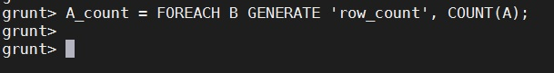

# Lab: Exploring Data with Pig

**Objective: Use Pig to navigate through HDFS and explore a dataset.**

*Following are the lab steps:*

*Open aws console and create an amazon EMR cluster.*

*Connect amazon EMR cluster to Mobaxterm SSH.*

1. Load the White House Visitor Data:

	*  Use the TextLoader to load the visits.txt file. From the Pig Grunt shell, define the 			following LOAD relation:

2. Count the Number of Lines:

	*  Define a new relation named B that is a group of all the records in A.

	*  Use DESCRIBE to view the schema of B.

	*  The A field of the B tuple is a bag of all of the records in visits.txt. Use the COUNT         	function on this bag to determine how many lines of text are in visits.txt.

	*  Use DUMP on A_count to view the result. The output should look like.

 
	*  We can now conclude that there are 447,598 rows of text in visits.txt.

3. Analyze the Data’s Contents:

	*  We now know how many records are in the data, but we still do not have a clear picture of             what the records look like. Let’s start by looking at the fields of each record. Load the data           using PigStorage(‘,’) instead of TextLoader(). This will split up the fields by comma.

	*  Use a FOREACH...GENERATE command to define a relation that is a projection of the first 10            fields of the visits relation.

	*  Use LIMIT to display only 50 records then DUMP the result. The output should be 50 tuples             that represent the first 10 fields of visits.

4. Locate the POTUS (President of the United States of America)

	*  There are 26 fields in each record, and one of them represents the visitee (the person being         visited in the White House). Your goal now is to locate this column and determine who has visited        the President of the United States. Define a relation that is a projection of the last seven             fields ($19 to $25) of visits. Use LIMIT to only output 500 records. The output should look like.

	*  It is not necessarily obvious from the output, but field $19 in the visits relation         	        represents the visitee. Even though you selected 500 records in the previous step, you may or 		        may not see POTUS in the output above. (The White House has thousands of visitors each day, but          only a few meet the President.)

	*  Use FILTER to define a relation that only contains records of visits where field $19 matches          POTUS. Limit the output to 500 records. The output should include only visitors who met with the         President. For example:

5. Count the POTUS Visitors:

	*  Let’s discover how many people have visited the President. To do this, we need to count the           number of records in visits where field $19 matches POTUS. See if you can write a Pig script to          accomplish this. Use the potus relation from the previous step as a starting point. You will             need to use GROUP ALL and then a FOREACH projection that uses the COUNT function.

        * If successful, you should get 21,819 as the number of visitors to the White House
        who visited the President.

grunt> potus_count = FOREACH potus_group GENERATE COUNT(potus);

6. Finding People Who Visited the President:

	*  So far you have used DUMP to view the results of your Pig scripts. In this step, you will             save the output to a file using the STORE command.

	*  Now FILTER the relation by visitors who met with the President.

	*  Define a projection of the potus relationship that contains the name and time of arrival of           the visitor.

	* Order the potus_details projection by last name.
	

	*  Store the records of potus_details_ordered into a folder named potus and using a comma 			delimiter:

	*  View the contents of the potus folder.

	*  Notice that there is a single output file, so the Pig job was executed with one reducer. View         the contents of the output file using cat. 

**Result**

*You have written several Pig scripts to analyze and query the data in the White House visitors’
log. You should now be comfortable with writing Pig scripts with the Grunt shell and using
common Pig commands like LOAD, GROUP, FOREACH, FILTER, LIMIT, DUMP, and STORE.*

